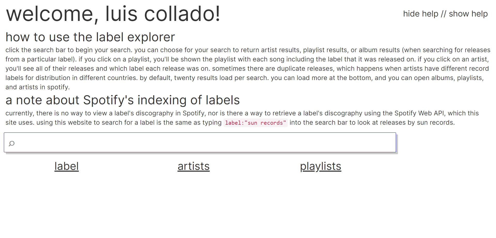

The label explorer had been a goal of mine for a long time. It ended up being my first real-ish Node.js project. I wanted to make a tool that would fight against what I saw as overly corporate control over Spotify's suggestions to indifferent users. I thought that if I made it easier to source your own suggestions (by using *labels*) instead of "station radio" or "undercurrents" then Spotify would be more democratic as a platform. As to whether or not that's a worthwhile struggle, I am not sure. Spotify pays artists almost nothing, and the label explorer really only improves the chance that someone uses Spotify the way they might Discogs or Bandcamp. I'm currently working on implementing a back button. You can view the repository [here](https://github.com/lui5c/spotify-label-explorer).

### Goal Functionalities

- View a Label's Releases
- View an Artist's Releases and which label released each album
- View which labels are represented on a playlist
- Labels and artist names are clickable


## Spotify Web API

Spotify has a [nicely documented API](https://developer.spotify.com/documentation/web-api/), which was simple to use. Since this was my first time working with Node.js, I only really used Node for redirecting and initial authorization. Everything else was handled client-side. 

### Template

I used Spotify's tutorial/example of a Spotify Web API Authentication Flow, found [here](https://developer.spotify.com/documentation/web-api/quick-start/). I got rid of everything that I didn't need - I basically only kept the greeting.

### Implementation

The implementation was done entirely in jQuery and JavaScript. I wanted webapp-like behavior, and didn't like the idea of a server call for each search. This was particularly important because I didn't want to spend any money on hosting the app, and if all of the logic and API requests could be handled client-side, then the only thing the web server would have to do would be handle initial authentication, which isn't very taxing. I used a lot of click handlers, and defined many functions that had subtly different jQuery AJAX calls to the Spotify Web API. These click handlers would pass JSON-ified information into functions that parsed them into tables, links, and lists. Here are a few examples:

```javascript
labelSearchButton.onclick = function() {barSearch("albums")}
artistSearchButton.onclick = function() {barSearch("artists")}
playlistSearchButton.onclick = function() {barSearch("playlists")}
```

These click handlers would trigger functions that read the text in the search bar and pass it into the real search function, which would send the AJAX request. Most requests were straightforward AJAX, except for the searches for releases by a label. In these searches I modified the search query to add <code>label:</code> and then the search query **in quotation marks**. 

```javascript
function searchAndDisplay(searchQuery, typeOfResult){
    /*...many lines of code....*/
	if (typeOfResult == "albums"){
  	console.log("searching label:\"" + searchQuery + "\"");
  	$("#results-list").empty();
  	$.ajax({
  		url: 'https://api.spotify.com/v1/search',
 		method: 'GET',
		headers: {
    		'Authorization': 'Bearer ' + access_token
  		},
  		data: {
    		q: "label:\"" + searchQuery + "\"",
    		type: 'album',
  		},
  		success: function(response){
    		for (var i = 0; i < response.albums.items.length; i++){
      			getLabelAndAdd(response.albums.items[i], 
                               response.albums.items[i].href);
      		}
    	setLoadMoreInfo("label_albums", response.albums.next);
  	}
  });
}
```
That's really the only big thing about the label explorer. Anything else is stored data, a <code>for</code> loop that is parsing JSON into DOM objects, or a jQuery function changing the CSS of something. This was before I had written code in React, (and also before I had learned about the HTML <code>template</code> element) and so I was writing DOM-composing functions that were really basically just convoluted string builders. An example:

```javascript
function addArtistResult(artistObject){
  var img = "<div class='div-img' style='background: url(";
  img += artistObject.images[0].url;
  img += "); background-position: 50% 50%; background-size: contain;'></div>";
  
  var title = "<a data-artistOnClick='true' data-href='";
  title += artistObject.href + "'>";
  title += artistObject.name + "</a>";
  
  var openExternal = "<a class='openexternal' href=\'";
  openExternal += artistObject.uri + "'>";
  openExternal += "open in Spotify // </a>";
  
  var secondRow = "<div class='second-row'>";
  secondRow += openExternal;
  secondRow += artistObject.genres[0];
  
  for (var i = 1; i < artistObject.genres.length; i++){
    secondRow += ", " + artistObject.genres[i];
  }
  
  var table = "<table class='response-container'>";
  table += "<tr><td>";
  table += title + "</td></tr>";
  table += "<tr><td>";
  table += secondRow + "</td></tr>";
  listElement = "<li class='list-group-item'>";
  listElement += img + table;
  listElement += "</li>";
  
  var DOM_adder = $(listElement).hide();
  $(resultsList).append(DOM_adder);
  DOM_adder.show('fast');
}
```
The only thing really of note would be taking advantage of the "data-" prefix for HTML attributes that allows you to store metadata in a DOM element. 

### Deploying

I deployed the app to Heroku, which was pretty simple. It tracks a GitHub repo and all you have to do it <code>git push heroku master</code>.  There are loads of easy-to-follows tutorials online. The only important thing to note is that you have to define your Spotify Client ID and Client Secret API keys as environment variables in your Heroku dyno, and then pass them into the Node.js app when it is run for someone. I made the mistake several times of committing code with my Client Secret and Client ID hard-coded into it.

### Future Development

It'd be nice to 

- deploy the app to something free that's not Heroku (waiting for the dyno to boot up each time is annoying)

- make it use HTML templates

Thanks for reading!

  