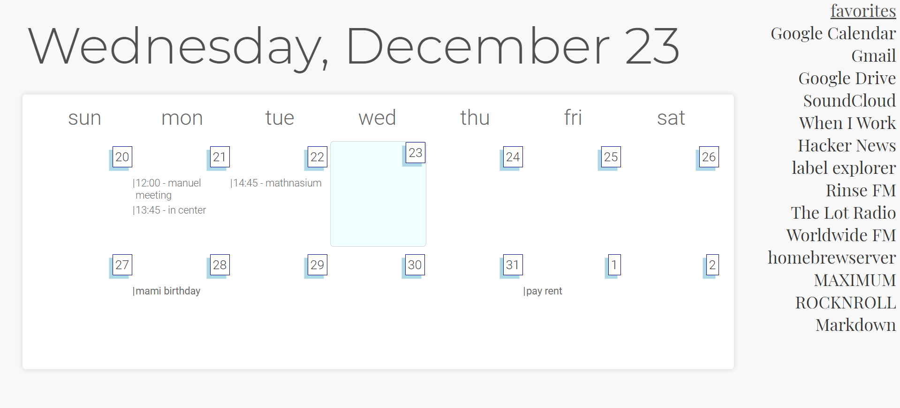

This one doesn't actually exist on my GitHub. That's because it relies pretty heavily on the Google Calendar API for its purpose/functionality. I wanted a new tab page that was out of my way, and I decided on a new tab that would display the current two weeks' events, show which day of the week we were at, and provide a quick list of favorites. I also wanted it to load fast, so it couldn't query any live APIs or require a local server. It ended up looking like this:



### It would be so cool to put on the Chrome Web Store!

It totally would. But I don't want to put something on the Chrome Web Store that requires you to go to a GitHub repo, download the files, go to the Google Developer console, get a Google Calendar API, and put the python script with your newly generated API key into the override directory of the chrome extension. It's messy and haphazard.

Additionally, I set up a Windows Task Scheduler task that refreshes the calendar data in the JSON file every day. That's just too many languages to ask someone to coordinate across for them to download something. Why not just write this guide?

### Extensionizr

To save me the first 30 minutes of Googling and figuring out how to write a Chrome extension, I was lucky enough to find the website [extensionizr.com](https://extensionizr.com/), which with a couple clicks gave me a very generously preformatted directory structure, ready for loading in unpacked into Google Chrome. All I had to do was write <code>index.html, styles.css</code> and <code>script.js</code> inside <code>src/override/</code> in the directory structure. This was very nice!

## Implementation

### Google Calendar API Call

I wrote a little Python script that asks for the desired data from the Google Calendar API. It parses it and prints it to a JSON file. This JSON file and the Python script both live in the same directory that my newtab-override code lives in. You only have to authenticate the Python script the first time you run it, because it saves a <code>token.pickle</code> and a <code>credentials.json</code> file that it checks every time it runs. 

### Calendar Parse

This is pretty weird. Since the index.html file that gets loaded by Chrome every time I open a new tab **is hosted locally**, I can make an AJAX request to another file that lives in the same directory and I get file read access to it. I'm not complaining:

```javascript
var JSONdictionary = (function () {
		var json = null;
		$.ajax({
			'async': false,
			'global': false,
			'url': "dictionary.json",
			'dataType': "json",
			'success': function (data) {
				json = data;
			}
		});
		return json;
	})();
```

This runs on document load. I then parse it into my HTML two-by-seven table that is my calendar. This time, I was smart enough to use an HTML template element to keep my code DRY, as opposed to writing [element composing functions](/label-explorer).

### Chromium API: Bookmarks

I also grab all of the bookmarks from the folder titled newtab-favorites in my Bookmarks bar. This allows me to choose which bookmarks I have quick access to and which ones I am hoarding. To do this, I had to set certain permissions in the manifest.json file of the extension: 

```json
...  
  "chrome_url_overrides": {
    "newtab": "src/override/index.html"
  },
  "permissions": [
    "bookmarks"
  ],
  "content_security_policy": "script-src 'self' https://ajax.googleapis.com/ajax/libs/jquery/3.5.1/jquery.min.js; object-src 'self'"
}
```

These allowed me to load jQuery (an external script), override the new tab page, and access Chrome's bookmarks.

Thanks for reading!